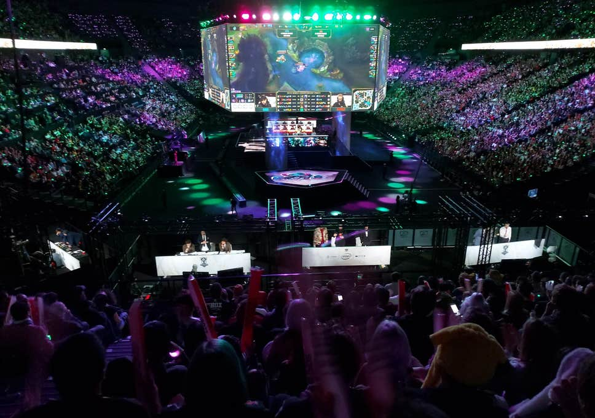
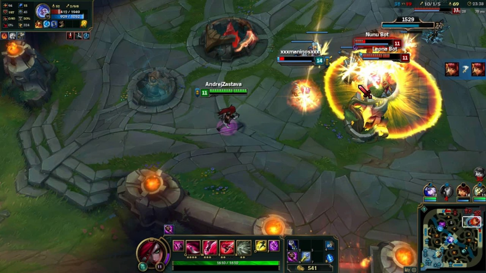
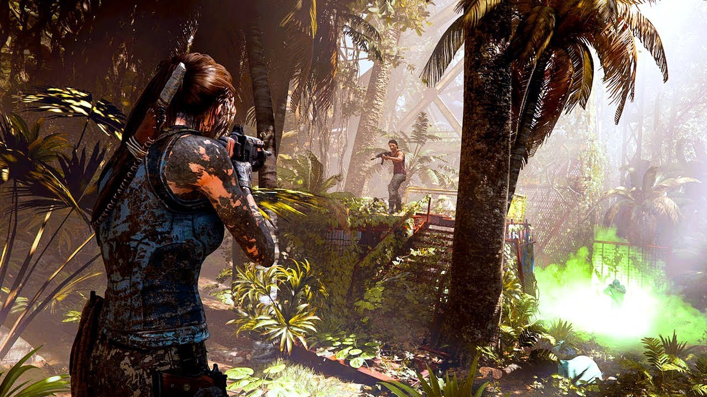
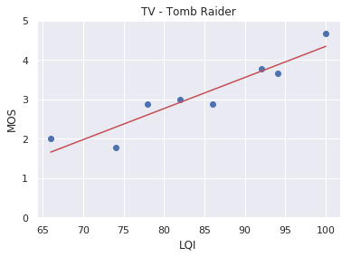
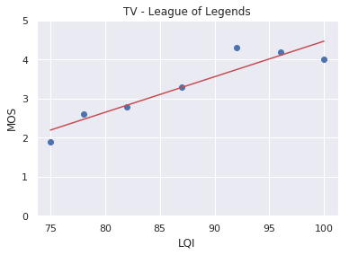
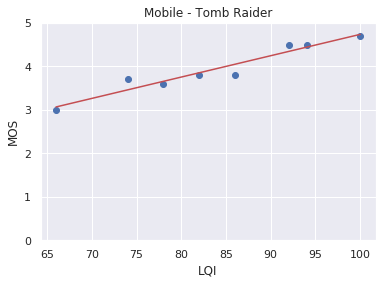
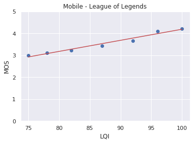

# Subjective Tests on Video Game Content

## Motivation

At Lightflow Media Technologies we get to spend one day per month to work on our own projects. This quarter we decided to explore the video game industry.

These are exciting times! Google just released [Stadia](https://stadia.google.com/), their cloud gaming platform. Facebook has made their move by [buying PlayGiga](https://www.theverge.com/2019/12/19/21029536/facebook-playgiga-cloud-gaming-acquisition-stadia-xcloud-playstation-now). The story does not end up here, Nvidia has also their on cloud gaming platform: [GeForce Now](https://www.nvidia.com/en-us/geforce-now/) and so does [Playstation](https://euw.leagueoflegends.com/en/). The technology behind these solutions is fascinating, and it is undeniable that video technology is very important for these solutions.

On the side of e-sports, this year has made records on viewers. [League of Legends](https://euw.leagueoflegends.com/en/), by [Riot Games](https://www.riotgames.com/en), 2019 World Finals has had a peak of [44 Million viewers and an average per minute of 21 Millions viewers](https://nexus.leagueoflegends.com/en-us/2019/12/2019-world-championship-hits-record-viewership/). This numbers should not be underestimated.

*League of Legends World Finals 2019. Held in AccorHotels Arena (capacity: 20300), Paris.*

The main idea of this whole project was to play around the concept of very specific content. What we wanted to find out is, for different video games and devices, how did the curve of MOS (Mean Opinion Square) vs Quality behaved. These are [well known curves](https://www.cns.nyu.edu/~lcv/ssim/) in the industry of video quality metrics. Another key point was to do so with our own metric: the Lightflow Quality Index (LQI) which is used in our [smart encoding solution](https://lightflow.media/). It is a video quality metric that ranges from 100 (perfect quality from source) to 0 (very poor quality)

## Design of the Experiment

Using an integer scale from 1 (bad) to 5 (excelent). We evaluated two video games that have different nature:

* [League of Legends](https://youtu.be/1VjyIsaUGEI?t=699): Isometric third person game, one of the most played e-sports.
* [Shadow of the Tomb Raider](https://youtu.be/JEjx6UbxHTc?t=4407): Third person game, very computer demanding.

*League of Legends screenshot.*

*Shadow of the Tomb Raider screenshot.*

We evaluated 9 subjects on two devices:

* PC display: **put dimensions and brand here and setting**
* Mobile phone: **put dimensions and brand here and setting**. [35% of Twitch users are on mobile](https://muchneeded.com/twitch-statistics/)

Each subject evaluated 16 fragments of Tomb Raider gameplay and 14 fragments of League of Legends for each device. This was done for 8 and 7 different per game respectively (each quality was evaluated twice). The source video was included in the evaluations and it is represented with an LQI of 100.

## TV Results

*Shadow of the Tomb Raider Curve on TV*

*League of Legends Curve on TV*

| Game | Min MOS | Max MOS | Interval |
|:----:|:-------:|:-------:|:--------:|
|  TR  |   1.78  |   4.66  |   2.88   |
|  LoL |   1.90  |   4.30  |   2.40   |

*League of Legends Curve on TV*

## Mobile Results

*Shadow of the Tomb Raider Mobile Curve*

*League of Legends Curve on Mobile*

| Game | Min MOS | Max MOS | Interval |
|:----:|:-------:|:-------:|:--------:|
|  TR  |   3.00  |   4.70  |   1.70   |
|  LoL |   3.00  |   4.22  |   1.22   |

*Table of the mobile results*

## Conclusions

1. The first thing to point out is that LQI is highly correlated with the MOS:

|    Test   | Pearson Correlation | P-value |
|:---------:|:-------------------:|:-------:|
|  TR - TV  |         0.94        |   5e-4  |
|  LoL -TV  |         0.93        |   2e-3  |
|  TR - Mob |         0.96        |   1e-4  |
| LoL - Mob |         0.98        |   7e-5  |

*Table of correlations and p-values of the measurements*

2. We can also see saturation of the quality perceived at high video qualities. Specially on League of Legends.
3. The quality perceived on mobile phone curves varies very little.
    * On League of Legends, we can go from **1080@2962Kbps (4 MOS)** to **720@1150Kbps (3 MOS)**.
    * On Tomb Raider, we can go from **1080@10522Kbps (4.8 MOS)** to **720@2695Kbps (3.5 MOS)**. 
4. Since the behavior of the MOS vs the Lightflow Quality Index is (almost) perfectly linear (** TODO: compute Rsquared values of the regression **). With a simple model, we are able to predict the quality perceived given a certain video quality for an specific video game on a specific display.

// TODO: with the model, compute true bitrate savings as an example
    
    