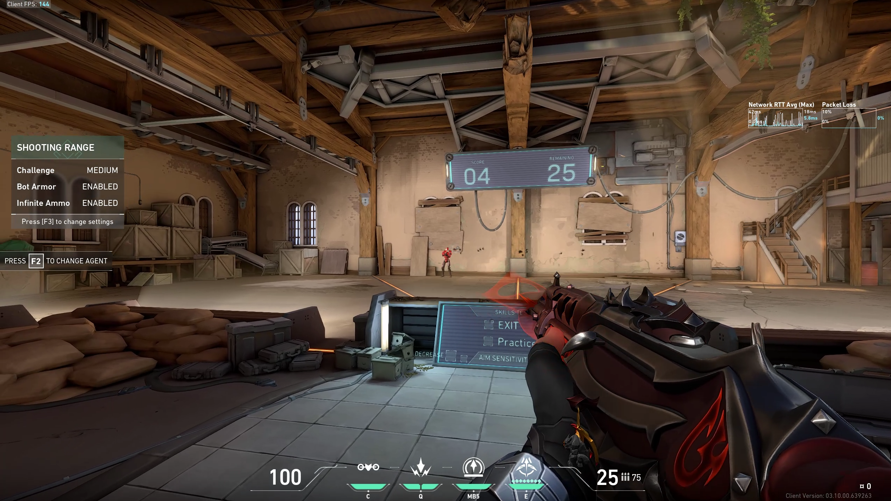
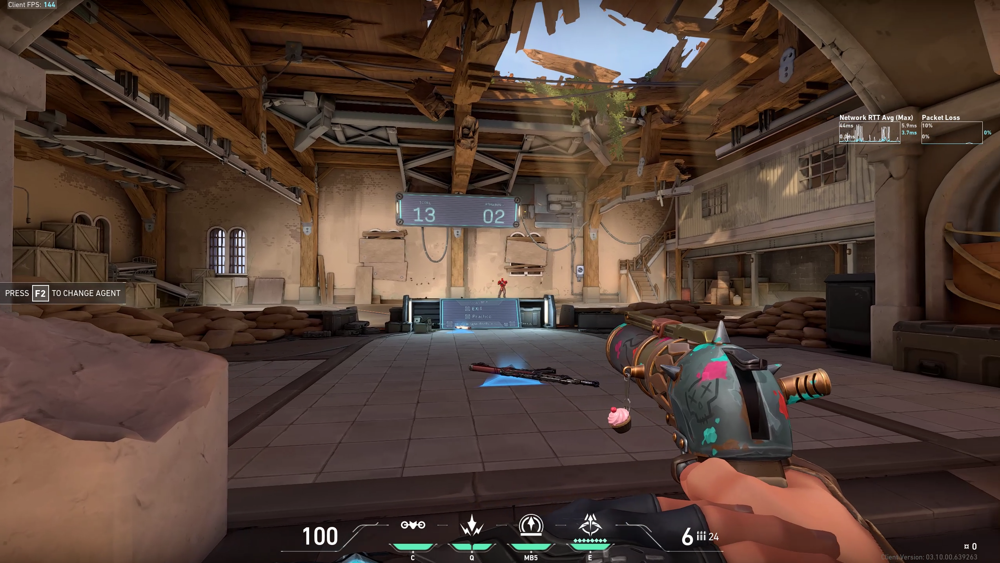
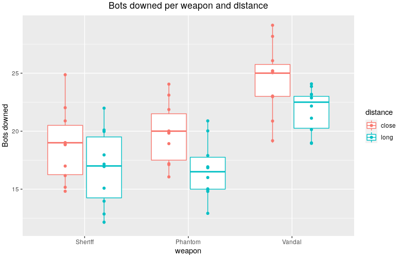
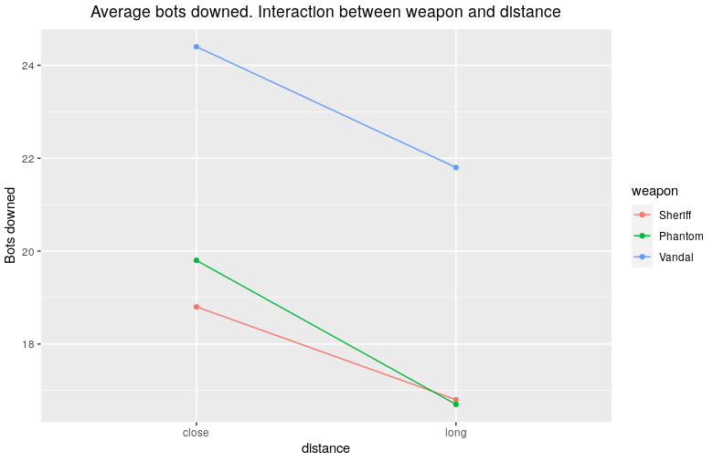
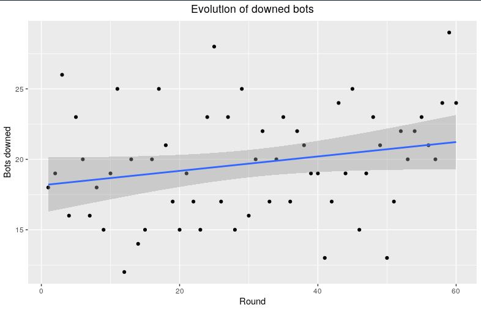
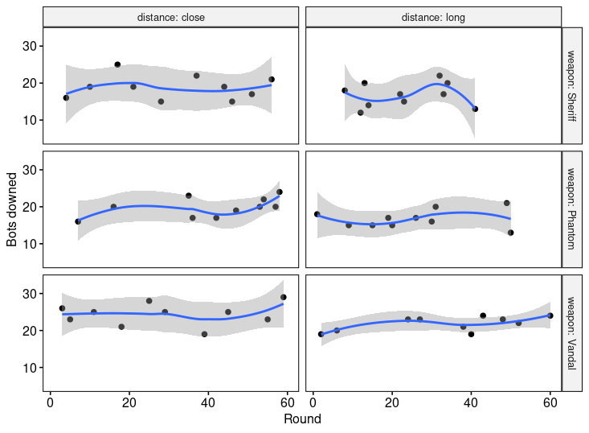

# VALORANT AIM

Author: Ignacio Peletier

## Introduction

VALORANT is a tactical free-to-play first person shooter developed by Riot Games and launched in June 2020. Given my love to the game I have worked on the experiment design, data collection and analysis of a simple set up. The analysis will try to answer the following questions:

* Which weapon am I better with?
* Does the distance affect the number of bots I am able to shoot down?
* Am I actually better with a weapon at close distance and with a different one at a further distance?
* As the rounds progressed, was I actually getting better?

## Experiment Set Up

The experiment set up was the following:

In the range, 30 bots were configured. They were static and had armor on (150 HP). The difficulty set was **medium**.

The shots were fired at two different distances labeled as "close" and "long". Shown in the pictures below: 

*Close distance*

*Long distance*

Three different weapons were used: Sheriff, Phantom and Vandal.

For each configuration, 10 measurements were taken, thus: `3 weapons x 2 distances x 10 measurements = 60 samples`. The order was randomized in order to reduce bias.

## Plotting the Data

Here is a plot of the distribution of downed bots per distance and weapon:

*Distribution of downed bots in different configurations* 

It can be observed that there are differences between close distance and long distance. Also the vandal has produced better results than the other two weapons. Later, it will be checked if these differences are in fact statistically significant and if they are, they will be quantified.

Now, another interesting point to check is the interaction between weapons and distance. In order words, am I better with a weapon at close distance and better with other at long distance? Or, does my accuracy decrease less with one weapon than with other one? The following plot shows these differences and tries to answer the question visually:

*Interaction between weapon and distance*

Again, in a different way, the decrease of number of bots downed at long distance can be seen. There seems to be a little bit of interaction between distance and the weapon type, specially seen with the Phantom, which produced better results at closer distance than with the Sheriff but at long distance both weapons performed fairly similar. This interaction will be later checked for statistical significance.

At last, here is the plot of the number of bots downed as the samples were being taken:

*Evolution of downed bots as samples were collected*

Later it will be checked if this slope is different from zero, in order to check if I was getting better or worse as the rounds progressed.

## Analysis

Two-way ANCOVA (Analysis of Covariance) will be used for the analysis of the effects of each variable: `weapon`, `distance` and `round`.

Before running the analysis the assumptions of the ANCOVA are checked.

### Linearity Assumption

The linearity is assessed by visual inspection of the covariate (`round`) for each available group:

*Linearity assumption plot*

The smoothing method used was *loess* (locally weighted smoothing). The plots are more or less linear, with some exceptions.

### Homogeneity of Regression Slopes

In order to proceed with the ANCOVA, it is important to check that there is no interaction between the covariate and each of the grouping variables. That is, it should be checked that the slope in the previous shown plot is the same for each group. The p-value obtained is `0.59` which indicates that this interaction is not statistically significant.

### Normality of Residuals

The Shapiro-Wilk Normality Test is run in the residuals of the model producing a p-value of `0.937` which is not significant and thus the normality of the residuals is assumed.

### Homogeneity of Variances

Levene's test is used to check that the variance of the residuals are equal between all the groups. The test yields a p-value of `0.482` which is again not significant and homogeneity of the residual variances is also assumed.

### Two Way ANCOVA

Now that all the assumptions are met, the two way ANCOVA is run on the data. Here is the summary of the ANOVA table:

| Effect          | DFn  | DFd  | F      | p        | p < 0.05 |
| --------------- | ---- | ---- | ------ | -------- | -------- |
| round           | 1    | 53   | 2.408  | 0.127    | NO       |
| weapon          | 2    | 53   | 21.982 | 1.12e-07 | YES      |
| distance        | 1    | 53   | 10.568 | 0.002    | YES      |
| weapon:distance | 2    | 53   | 0.202  | 0.818    | NO       |

Both the effect of `round` and the interaction term (`weapon:distance`) are not significant. This means that as the rounds progressed the number of bots downed did not increase and also that the effect that the distance in the count of bots downed has does not change with the weapon.

An F test is run with the previous model and a reduced one, which has no interaction term and `round` is removed. The test yields a non significant p-value of `0.4306`, with statistic `F(53, 56) = 0.9345`, meaning that both models are statistically the same.

### Pairwise Comparisons

Using the previous **reduced** model, a Tukey HSD (Honest Significant Difference) test is run, in order to quantify the differences between the groups. Here are the results of the test:

* The differences between the Phantom and the Sheriff are not significant. (p-value of `0.8645`).
* The Vandal produced an average of `5.30` more bots downed than the Sheriff. This value is significant (p-value = `0.0000004`). The 95% Confidence Interval for this parameter is (`3.1954, 7.4046`).
* The Vandal produced an average of `4.85` more bots downed than the Phantom. This value is significant (p-value = `0.0000024`). The 95% CI for this parameter is (`2.7454, 6.9546`).
* At long distance, the average of bots downed was `2.5667` **less** than at long distance. This value is significant (p-value = `0.0006838`). The 95% CI for this parameter is (`1.1368, 3.9965`).

## Conclusions

1. The Vandal produced significant better results than the other weapons.
2. Both the Sheriff and the Phantom produced similar results, which is surprising given how different the weapons are.
3. The degradation in accuracy due to the fact of shooting further is the same between the weapons.
3. There was no significant improvement as more rounds were being done.

## Disclaimer

* It is very important to note that the data analyzed comes from one player (me) and that the conclusions might not apply to other players, although the same analysis could be run to check the results for other people.
* It is not the same shooting at the range to the bots than in a game against other people (which actually shoot you back) so this analysis is limited by that fact.
* All the code is available in my github: https://github.com/Sorkanius/articles/tree/master/valorant_aim
* If you want to see me play here are some VALORANT clips of mine: https://www.youtube.com/channel/UCYj6rQZTnRH0p6xi3qWJa_A

I hope you found this analysis interesting. Feel free to reach me if you have any questions or are interested in more!