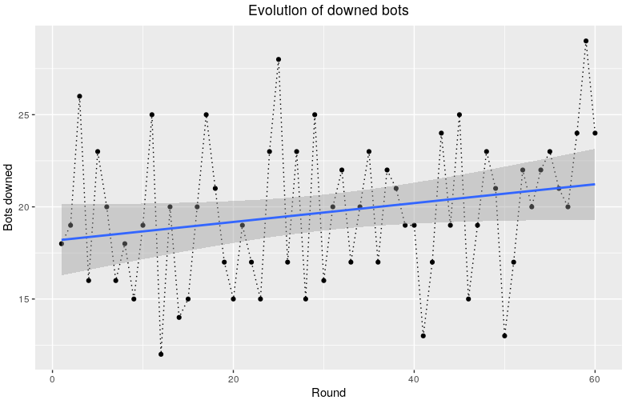

## Introduction

The analysis will try to answer the following questions:

* Which weapon I am better with?
* Does the distance affect the number of bots I am able to shoot down?
* Is there any interaction between the weapons and the distance? Or am I actually better with a weapon at close distance and with a different one at a further distance?
* As the rounds progressed, was I actually getting better?

## Experiment Set Up

The experiment set up was the following:

In the range, 30 bots were configured. They were static and had armor on (150 HP). The difficulty set was **[insert difficulty]**.

The shots were fired in two different distances **[put distances approx or images]**.

Three different weapons were used: Sheriff, Phantom and Vandal.

## Analysis

Let's take a look at the distribution of down bots per distance and weapon;

## Results

## Conclusions
